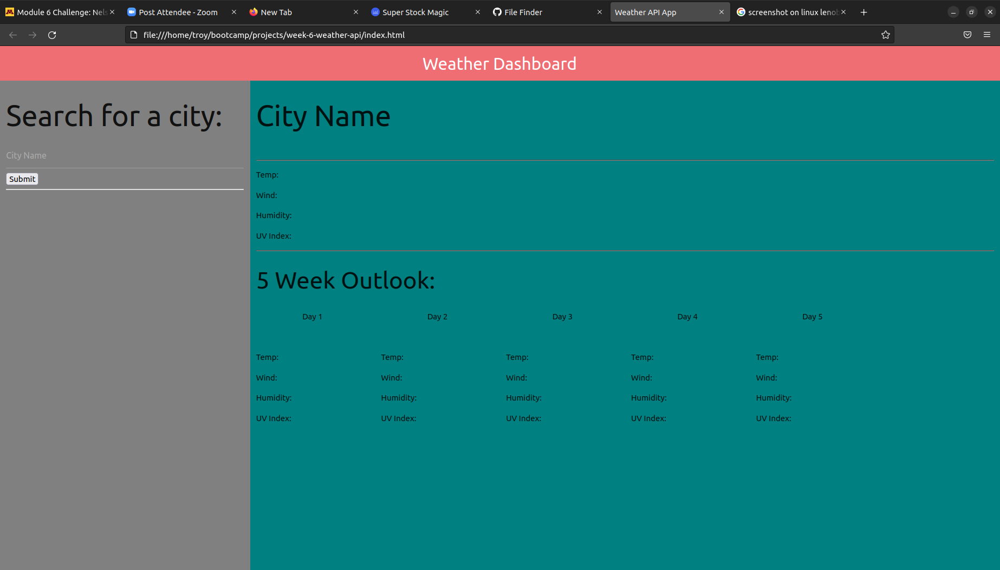

Weather Dashboard

this app allows a user to search for weather in a city and get a five day forcast including temperature, humidity, uv index, and wind speed.

i hardcoded all the html and then attached all html elements to their individual variable in javascript, i then changed their text to the api values accordingly.

  